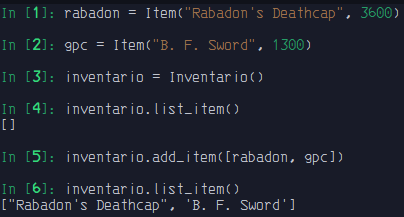

# Agregação

- É um tipo especial de associação onde tenta-se demonstrar que as informações de um objeto (chamado objeto-todo) precisam ser complementados pelas informações contidas em um ou mais objetos de outra classe (chamados objetos-parte) conhecemos como todo/parte. 

- Essas partes podem existir separadamente.

```python3
from typing import Type, List


class Item:
    def __init__(self, name: str, price: int) -> None:
        self.name = name
        self.price = price


class Inventario:
    def __init__(self) -> None:
        self.__inventory = []

    def add_item(self, itens: List[Type[Item]]):
        for item in itens:
            self.__inventory.append(item)

    def list_item(self) -> list:
        itens_name = [name.name for name in self.__inventory]
        print(itens_name)
```

`out:`

