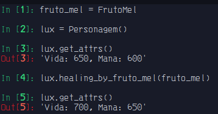

# Associação

- Usamos geralmente quando um método irá receber uma classe, para isso usamos o mudulo [Typing](https://docs.python.org/3/library/typing) para auxiliar-nos. 
- É um relacionamento entre classes.

```python3
from typing import Type


class FrutoMel:
    def heal() -> dict:
        attrs = {"fruto_mel_life": 0, "fruto_mel_mana": 0}
        n = 0
        while n < 5:
            n += 1
            attrs["fruto_mel_life"] += 10
            attrs["fruto_mel_mana"] += 10

        return attrs


class Personagem:
    def __init__(self) -> None:
        self.life = 650
        self.mana = 600

    def healing_by_fruto_mel(self, fruto_mel: Type[FrutoMel]) -> None:
        self.life += fruto_mel.heal()["fruto_mel_life"]
        self.mana += fruto_mel.heal()["fruto_mel_mana"]

    def get_attrs(self) -> str:
        return f"Vida: {self.life}, Mana: {self.mana}"

```

> Nota-se que o método healing_by_fruto_mel recebe a classe FrutoMel é agr é capaz de acessar não só métodos, mas também atributos dela.

`out:`


