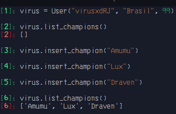

# Composição

-  Uma composição tenta representar também uma relação todo/parte.
- No entanto, na composição o objeto-todo é responsável por criar e destruir suas partes.
- Em uma composição, um mesmo objeto-parte não pode se associar a mais de um objeto-todo.

```python3
class Personagem:
    def __init__(self, name) -> None:
        self.name = name


class User:
    def __init__(self, username: str, country: str, age: int) -> None:
        self.username = username
        self.country = country
        self.age = age
        self.champions = []

    def insert_champion(self, name: str) -> None:
        self.champions.append(Personagem(name))

    def list_champions(self) -> list:
        return [champion.name for champion in self.champions]

```

`out:`

