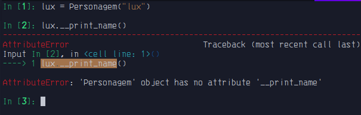
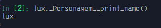

# Encapsulamento

 - Trata-se de uma forma de proteger seus métodos e atributos.

    >**__[Python Doc](https://docs.python.org/pt-br/3/tutorial/classes.html#private-variables)__**
    >
    >Variáveis de instância “privadas”, que não podem ser acessadas, ​exceto em métodos do próprio objeto, <span style="color: red"> Não </span>existem em Python.

- Em python a forma de encapsulamento é apenas uma convensão.

### Métodos e atributos <span style="color: green">públicos</span>.

- Pode ser acessado tanto de dentro quanto de fora da classe.

```python3
class Personagem:
    def __init__(self, name: str) -> None:
        self.name = name

    def print_name(self) -> str:
        print(self.name)
```

### Métodos e atributos <span style="color: blue">protegidos</span>.

- Pode ser acessado pela classe e por sub-classes.

- Por convenção definimos um método ou atributo potegidos com um "_" como prefixo.


```python3
class Personagem:
    def __init__(self, name: str) -> None:
        self._name = name

    def _print_name(self) -> str:
        print(self._name)
```

### Métodos e atributos <span style="color: purple">privados</span>.

- Pode ser acessado somente pela classe.

- Por convenção definimos um método ou atributo potegidos com dois "_" como prefixo.

    >**__Fato curioso__:**
    >
    > Com a necessidade de se falar "double underscore" em uma PyCon a todo momento, por convenção começou a falar-se "dunder".

```python3
class Personagem:
    def __init__(self, name: str) -> None:
        self.__name = name
    
    def __print_name(self) -> str:
        print(self.__name)
```

`out:`



>**__Observação__:**
>
> O método ainda pode ser acessado, mas agora de forma diferente
basta chama-lo da seguinte forma:
>
> ```bash
>instância._Classe.(método ou atributo)
>```
>
>`out:`
>
>