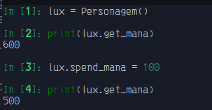

# Getter e Setter

Seram usados para ler, modificar ou atributos de instância, sem modifica-los de forma direta.

Para isso usaremos os decoradores:

```python3
@property @{atributo}.setter
```

- Getter:

    Usamos o getter para acessar um atributo de instância, geralmente "privado" com o [decorator](<a target="_blank" href="https://peps.python.org/pep-0318"/>)
    `@property`.

    Além disso o `@property` altera a propriedade do método transformando-o em um atributo. 

    
    ```python3
    class Personagem:
    def __init__(self) -> None:
        self.__mana = 600

    @property
    def get_mana(self) -> int:
        "retorna o valor de mana."
        return self.__mana
    ```

    > **_Observação_:**
    >
    > se o método tiver uma docstring o atributo terá uma também.
    > 

    `out:`
    
    

- Setter:
    
    Usamos o setter para modificar um atributo de classe.

    >**__Observação__:** 
    >
    >Para criar um setter necessitamos de um getter.

    ```python3
    class Personagem:
    def __init__(self) -> None:
        self.__mana = 600

    @property
    def get_mana(self) -> int:
        "retorna o valor de mana."
        return self.__mana

    @get_mana.setter
    def spend_mana(self, value: int) -> int:
        self.__mana = self.__mana - value
    ```

    `out:`

    
