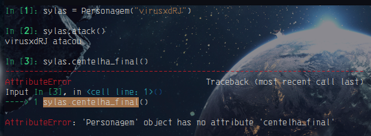
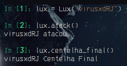

# Herança

- Um objeto pode ter métodos e atributos de outra classe por herança, isso significa que a classe tem todas características da classe herdada, além de poder ter as suas próprias.

- Uma das grandes vantagens de usar esse recurso é na reutilização do código. Esse reaproveitamento pode ser acionado quando se identifica que o atributo ou método de uma classe será igual para as outras.

- Para efetuar uma herança de uma classe é passado o nome da classe como parâmetro.

```python3
class Personagem:
    def __init__(self, name: str) -> None:
        self.name = name

    def atack(self) -> str:
        print(f"{self.name} atacou")

    def andar(self) -> str:
        print("{self.name} está andando")


class Lux(Personagem):
    def __init__(self, nickname: str) -> None:
        super().__init__(nickname)

    def centelha_final(self) -> str:
        print("{} Centelha Final".format(self.name))
```

- Para podermos acessar os métodos da classe "Pai", ou classe a qual foi herdados os metodos:
    
    ```python3
    super().método()
    ```

    `ou`

    ```python3
    Classe().método()
    ```

`out:`



> **__Note:__**
>
> Sylas nesse exemplo sylas não tem o método centelha_final, pois esse método não o pertece.



> **__Note:__**
>
> Como a classe Lux herda de Personagem, ela tem acesso ao método atack, e tem seu proprio método centelha_final 
