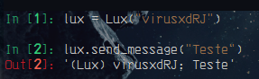

# Sobreposição de métodos

- Métodos herdados podem ser sobrescritos dentro da classe.

- Para usar a lógica do método sobrescrito e adicionar mais linhas de código é necessário passar ao método `super()` que se refere a classe que está sendo herdada.

- Para referenciar uma classe específica dentro da cadeia de herança é necessário passar o nome da classe com o método e por parâmetro o self.

```python3
class Personagem:
    def __init__(self, name: str) -> None:
        self.name = name

    def atack(self) -> str:
        print(f"{self.name} atacou")

    def andar(self) -> str:
        print(f"{self.name} está andando")

    def send_message(self, msg: str) -> str:
        print(f"{self.name}: {msg}")


class Lux(Personagem):
    def __init__(self, nickname: str) -> None:
        super().__init__(nickname)

    def centelha_final(self) -> str:
        print("{} Centelha Final".format(self.name))
        
    def send_message(self, msg: str) -> str:
        return f"(Lux) {self.name}: {msg}"
```

`out:`



> *__Note:__*
>
>Tanto Personagem quando Lux tem o método `send_message()`, como Lux herda de Personagem ela também tem o método, mas nesse exemplo elefoi sobre escrito com output diferent.