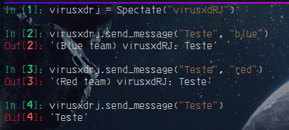

# Herança multipla

- É o conceito de herança de duas ou mais classes.

```python3
from typing import Optional


class User:
    def __init__(self, username: str) -> None:
        self.username = username

    def send_message(self, msg: str) -> str:
        return f"{self.username}: {msg}"

class BlueTeam(User):
    def __init__(self, username: str) -> None:
        super().__init__(username)

    def send_message(self, msg: str) -> str:
        return f"(Blue team) {super().send_message(msg)}"

class RedTeam(User):
    def __init__(self, username: str) -> None:
        super().__init__(username)

    def send_message(self, msg: str) -> str:
        return f"(Red team) {super().send_message(msg)}"

class Spectate(BlueTeam, RedTeam):
    def __init__(self, username: str) -> None:
        super().__init__(username)

    def send_message(self, msg: str, team: Optional[str] = None) -> str:
        match team:
            case "red":
                return RedTeam(self.username).send_message(msg)
            case "blue":
                return BlueTeam(self.username).send_message(msg)
        return msg
```

`out:`



> **__Note:__**
>
>Como a classe Spectate herda tanto de BlueTeam, quanto de RedTeam somo capazes de acessar os metodos send_message de ambas.
>