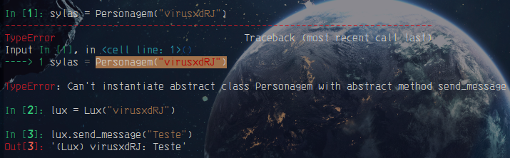

# Polimorfismo

- Em python o único polimorfismo que a linguagem suporta é por [sobreposição](method_overlay.md), que é o princípio que permite que classes derivadas de uma mesma superclasse tenham métodos iguais (de mesma assinatura) mas comportamentos diferentes.

```python3
from abc import ABC, abstractmethod

class Personagem(ABC):
    def __init__(self, name: str) -> None:
        self.name = name

    def atack(self) -> str:
        print(f"{self.name} atacou")

    def andar(self) -> str:
        print(f"{self.name} está andando")

    @abstractmethod
    def send_message(self, msg: str) -> str:
        print(f"{self.name}: {msg}")


class Lux(Personagem):
    def __init__(self, nickname: str) -> None:
        super().__init__(nickname)

    def centelha_final(self) -> str:
        print("{} Centelha Final".format(self.name))
        
    def send_message(self, msg: str) -> str:
        return f"(Lux) {self.name}: {msg}"
```

`out:`



> **__Note:__**
>
> - Quando tentamos instanciar a classe pai, o python emite um TypeError falando que  a classe Personagem com o método abstrato send_message() não pode ser instanciada.
> - Portando a classe pai não destina-se a ser instanciad.a
