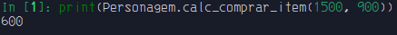
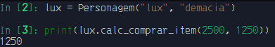

# Métodos estáticos

Usado para criar funções de utilidade.
- não tem referência da classe.
- não tem acesso aos atributos de instância nem aos de classe.
- pode-se dizer que não se passam de uma "função comoum". 

```python3
from typing import Optional


class Personagem:
    mana = 200

    def __init__(self, name: str, pais: str) -> None:
        self.name = name
        self.pais = pais

    @classmethod
    def pegar_mana(cls, mana: Optional[int] = None) -> int:
        if mana:
            cls.mana = mana
        return cls.mana

    @classmethod
    def registrar_personagem(cls, nome: str, pais: str, mana: int):
        cls.mana = mana
        return cls(nome, pais)

    @staticmethod
    def calc_comprar_item(gold: int, item: int) -> int:
        if not item > gold:
            return gold - item
        return f"Gold insuficiente"
```

- chamando-o direto pela classe:



- chamando quando for instânciado:

